<div align="center">

<!-- Animated ASCII Art Header - Claude Code brick style -->


<br/>


<br/>

[](https://anthropic.com)
[](https://openai.com)
[](https://deepmind.google)
[](LICENSE)

<br/>

[](https://github.com/unisone/ai-prompts/actions/workflows/ci.yml)
[](CONTRIBUTING.md)
[](https://github.com/unisone/ai-prompts/issues)
[](https://github.com/unisone/ai-prompts/graphs/contributors)
[](https://github.com/unisone/ai-prompts/commits/main)

<br/>

[Quick Start](#-quick-start) | [Categories](#-categories) | [Pro Prompts](#-pro-prompts-for-sponsors) | [Contributing](#-contributing)

</div>

---

## What's Inside

Battle-tested prompts optimized for **Claude Code**, **Claude Opus 4.5**, **GPT-5.2**, and other frontier models. Each prompt follows a consistent template with variables, examples, and usage notes.

```
  +-----------------------------------------------------------------+
  |                                                                 |
  |   PROMPT ANATOMY                                                |
  |   --------------                                                |
  |                                                                 |
  |   +---------------+                                             |
  |   |  # Title      | <- What it's called                         |
  |   +---------------+                                             |
  |   |  Description  | <- What it does                             |
  |   +---------------+                                             |
  |   |  Prompt       | <- The actual prompt text                   |
  |   +---------------+                                             |
  |   |  {{vars}}     | <- Customizable placeholders                |
  |   +---------------+                                             |
  |   |  Examples     | <- Real usage samples                       |
  |   +---------------+                                             |
  |   |  Notes        | <- Tips and model recommendations           |
  |   +---------------+                                             |
  |                                                                 |
  +-----------------------------------------------------------------+
```

## Quick Start

```bash
# Clone the repository
git clone https://github.com/unisone/ai-prompts.git

# Browse prompts by category
cd ai-prompts && ls -la coding/
```

**Or** just copy any prompt directly from GitHub into your AI assistant of choice.

## Categories

```
ai-prompts/
|
+-- coding/        # 8 prompts: Code review, debugging, testing, refactoring
|   +-- code-review-checklist.md      # 10-point security & logic review
|   +-- debug-systematic.md           # 8-step debugging methodology
|   +-- refactor-safely.md            # 5-phase safe refactoring
|   +-- api-endpoint-design.md        # REST/GraphQL design template
|   +-- test-generator.md             # Happy path + edge cases
|   +-- explain-codebase.md           # Understand unfamiliar code
|   +-- ultrathink-code-craftsman.md  # Philosophy-driven system prompt
|   +-- structured-reasoning-planner.md
|
+-- writing/       # 2 prompts: Technical docs, resume optimization
|   +-- technical-documentation.md    # README, API docs, runbooks
|   +-- ultrathink-resume-architect.md
|
+-- analysis/      # 1 prompt: Data insights extraction
|   +-- data-insights.md              # Patterns, anomalies, actions
|
+-- creative/      # Coming soon
+-- research/      # Coming soon
+-- templates/     # Base templates for creating new prompts
```

| Folder | Prompts | Highlights |
|--------|---------|------------|
| [`coding/`](./coding) | 8 | Code review, debugging, testing, refactoring, API design |
| [`writing/`](./writing) | 2 | Technical documentation, resume optimization |
| [`analysis/`](./analysis) | 1 | Data insights extraction |
| [`templates/`](./templates) | 1 | Base template for new prompts |

**Total: 12 battle-tested prompts**

## Featured Prompts

<table>
<tr>
<td width="50%">

### 🔍 Code Review Checklist
**File:** `coding/code-review-checklist.md`

10-point systematic review covering:
- Logic errors (off-by-one, null checks)
- Security vulnerabilities (injection, XSS)
- Performance anti-patterns
- Edge case handling

[View Prompt](./coding/code-review-checklist.md)

</td>
<td width="50%">

### 🐛 Systematic Debugging
**File:** `coding/debug-systematic.md`

8-step debugging methodology:
1. Reproduce → 2. Observe → 3. Hypothesize →
4. Test → 5. Trace → 6. Verify → 7. Root cause → 8. Fix

[View Prompt](./coding/debug-systematic.md)

</td>
</tr>
<tr>
<td width="50%">

### ♻️ Refactor Safely
**File:** `coding/refactor-safely.md`

5-phase approach to safe refactoring:
Assessment → Safety Net → Incremental Changes → Verification → Cleanup

[View Prompt](./coding/refactor-safely.md)

</td>
<td width="50%">

### 🧪 Test Generator
**File:** `coding/test-generator.md`

Generate comprehensive tests:
- Happy path scenarios
- Boundary conditions
- Error handling cases

[View Prompt](./coding/test-generator.md)

</td>
</tr>
<tr>
<td width="50%">

### 🗺️ Explain Codebase
**File:** `coding/explain-codebase.md`

9-part analysis for unfamiliar codebases:
Architecture → Entry points → Data flow → Dependencies → Patterns

[View Prompt](./coding/explain-codebase.md)

</td>
<td width="50%">

### 🧠 Code Craftsman
**File:** `coding/ultrathink-code-craftsman.md`

Philosophy-driven system prompt that transforms AI from code generator to software craftsman.

[View Prompt](./coding/ultrathink-code-craftsman.md)

</td>
</tr>
</table>

---

## Pro Prompts for Sponsors

<div align="center">

**The prompts above are good. The ones below built a 577-file production app.**

[](https://github.com/sponsors/unisone)

</div>

### What Sponsors Get

| Free (This Repo) | Pro (Sponsors Only) |
|------------------|---------------------|
| General-purpose prompts | Production system prompts I use daily |
| Basic templates | Multi-file refactoring patterns |
| Community examples | "Ship Feature in 2 Hours" workflow |
| | Senior code review prompt (catches security issues) |
| | API architect system prompt |
| | TDD workflow that works with AI |
| | New prompts added monthly |

### Pro Prompt Preview

These prompts are in the **sponsors-only repository**:

```
ai-prompts-pro/
|
+-- system-prompts/
|   +-- full-stack-ai-engineer.md      # The exact prompt I use daily
|   +-- code-review-senior.md          # Catches bugs juniors miss
|   +-- api-architect.md               # Design scalable APIs first try
|
+-- patterns/
|   +-- multi-file-refactor.md         # Refactor 50+ files safely
|   +-- test-driven-ai.md              # TDD that works with AI
|   +-- debug-production.md            # Systematic debugging
|
+-- workflows/
    +-- ship-feature-fast.md           # Feature dev in < 2 hours
    +-- fix-bug-systematic.md          # Never chase wrong solutions
```

### Real Results

These prompts helped me build:

| Metric | Result |
|--------|--------|
| TypeScript files | 577 |
| API endpoints | 55 |
| Test files | 84 |
| Critical production bugs | 0 |
| Time to ship features | < 2 hours |

<div align="center">

[](https://github.com/sponsors/unisone)

*Your sponsorship funds continued research and new prompt development.*

</div>

---

## Prompt Template

```markdown
# Prompt Name

## Description
What this prompt does and when to use it.

## Prompt
The actual prompt text with {{variables}} for customization.

## Variables
- `{{variable}}`: What to replace it with

## Example
A filled-in example showing the prompt in action.

## Notes
- Tips for best results
- Model-specific recommendations
- Known limitations
```

## Contributing

We welcome contributions from the community! Whether you're submitting a new prompt, improving an existing one, or fixing a typo - every contribution helps.

```
+----------------------------------------------------------------+
|  CONTRIBUTION WORKFLOW                                         |
|  =====================                                         |
|                                                                |
|  1. Fork and Clone    ->  git clone your-fork                  |
|  2. Create Branch     ->  git checkout -b feat/my-prompt       |
|  3. Add Prompt        ->  Follow templates/example-prompt.md   |
|  4. Test with AI      ->  Verify with at least one model       |
|  5. Submit PR         ->  Use our PR template                  |
|                                                                |
|  Full guide: CONTRIBUTING.md                                   |
|  Code of Conduct: CODE_OF_CONDUCT.md                           |
|                                                                |
+----------------------------------------------------------------+
```

### Quick Links

| Resource | Description |
|----------|-------------|
| [Contributing Guide](CONTRIBUTING.md) | Detailed contribution instructions, style guide, and checklist |
| [Code of Conduct](CODE_OF_CONDUCT.md) | Community standards and expectations |
| [Security Policy](.github/SECURITY.md) | How to report vulnerabilities |
| [Report a Bug](https://github.com/unisone/ai-prompts/issues/new?template=bug-report.yml) | Found an issue? Let us know |
| [Request Feature](https://github.com/unisone/ai-prompts/issues/new?template=feature-request.yml) | Suggest improvements |
| [Submit New Prompt](https://github.com/unisone/ai-prompts/issues/new?template=new-prompt.yml) | Share your prompt idea |

### Naming Convention

```bash
<descriptive-name>.md

# Examples:
coding/react-component-generator.md
writing/blog-post-outline.md
analysis/sentiment-analyzer.md
```

### First-Time Contributors

New to open source? Here's how to get started:

1. **Browse [open issues](https://github.com/unisone/ai-prompts/issues)** - look for `good first issue` labels
2. **Read [CONTRIBUTING.md](CONTRIBUTING.md)** - understand our guidelines
3. **Fork the repo** - click the Fork button at the top right
4. **Make your changes** - follow the template structure
5. **Open a PR** - we'll review it promptly!

## Development

This project uses modern 2026 tooling for quality assurance.

### Tech Stack

| Tool | Purpose |
|------|---------|
| [pnpm 9.x](https://pnpm.io) | Fast, disk-efficient package manager |
| [Node 22.x](https://nodejs.org) | JavaScript runtime |
| [Prettier 3.x](https://prettier.io) | Code formatting |
| [Markdownlint](https://github.com/DavidAnson/markdownlint) | Markdown linting |
| [Husky 9.x](https://typicode.github.io/husky) | Git hooks |
| [Commitlint](https://commitlint.js.org) | Commit message linting |

### Local Setup

```bash
# Clone the repository
git clone https://github.com/unisone/ai-prompts.git
cd ai-prompts

# Install dependencies (requires pnpm)
pnpm install

# Run linters
pnpm run lint          # Run all linters
pnpm run lint:md       # Markdown only
pnpm run lint:format   # Prettier check
pnpm run lint:spell    # Spell check

# Auto-fix issues
pnpm run format        # Fix formatting
pnpm run format:md     # Fix markdown
```

### CI/CD Pipeline

Every PR automatically runs:
- Markdownlint - Enforces consistent markdown style
- Prettier - Checks formatting
- CSpell - Catches spelling errors
- Lychee - Validates all links
- Prompt Validation - Ensures required sections exist

### Automation

| Workflow | Trigger | Purpose |
|----------|---------|---------|
| **CI** | Push/PR | Lint, format, validate |
| **Release** | Tags | Generate changelog, create release |
| **Stale** | Daily | Mark inactive issues/PRs |
| **Welcome** | New issue/PR | Greet first-time contributors |
| **Labels** | Manual/push | Sync GitHub labels |
| **Dependabot** | Weekly | Update dependencies |

## Prompt Engineering Tips

<details>
<summary><strong>Role and Persona</strong></summary>

Define a clear identity for the AI:
```
You are a senior software architect with 15 years of experience...
```
</details>

<details>
<summary><strong>Structured Output</strong></summary>

Request specific formats for consistent results:
```
Respond in this JSON format:
{
  "summary": "...",
  "recommendations": ["..."],
  "confidence": 0.0-1.0
}
```
</details>

<details>
<summary><strong>Chain of Thought</strong></summary>

For complex reasoning, ask the model to think step-by-step:
```
Before answering, reason through:
1. What are the key constraints?
2. What are the possible approaches?
3. What are the trade-offs?
Then provide your recommendation.
```
</details>

<details>
<summary><strong>Few-Shot Examples</strong></summary>

Provide examples of desired input/output:
```
Example 1:
Input: "The product is okay"
Output: { "sentiment": "neutral", "score": 0.5 }

Example 2:
Input: "Absolutely love it!"
Output: { "sentiment": "positive", "score": 0.95 }

Now analyze: {{user_input}}
```
</details>

<details>
<summary><strong>2026 Model-Specific Tips</strong></summary>

| Model | Optimization |
|-------|--------------|
| **Claude Opus 4.5** | Use extended thinking for complex tasks, leverage artifacts for code output |
| **Claude Code** | Reference `CLAUDE.md` for project context, use TodoWrite for task tracking |
| **GPT-5.2** | Use structured outputs with JSON mode, leverage GPT-5.2 Thinking for long-context |
| **Gemini 3 Pro** | Excellent for multimodal inputs, use grounding with Google Search |

</details>

## Integration Ideas

### With Claude Code
```bash
# Reference prompts directly in CLAUDE.md
cat ai-prompts/coding/structured-reasoning-planner.md >> .claude/CLAUDE.md
```

### With Custom GPTs
Import prompts as system instructions when building custom GPT assistants.

### With API Calls
```typescript
const systemPrompt = await fetch(
  'https://raw.githubusercontent.com/unisone/ai-prompts/main/coding/ultrathink-code-craftsman.md'
).then(r => r.text());
```

---

<div align="center">

## Contributors

Thanks to everyone who has contributed to this project!

<a href="https://github.com/unisone/ai-prompts/graphs/contributors">
  
</a>

<br/><br/>

```
+---------------------------------------------------------------------+
|                                                                     |
|   Built by Alex Zaytsev                                             |
|   github.com/unisone                                                |
|                                                                     |
|   Star this repo if you find it useful                              |
|   PRs welcome - check CONTRIBUTING.md                               |
|   Sponsor for Pro prompts - github.com/sponsors/unisone             |
|                                                                     |
+---------------------------------------------------------------------+
```

</div>
